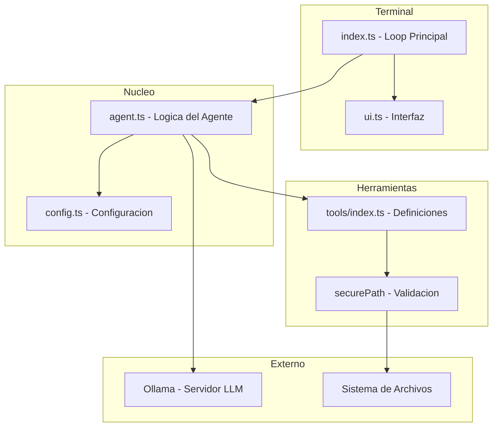
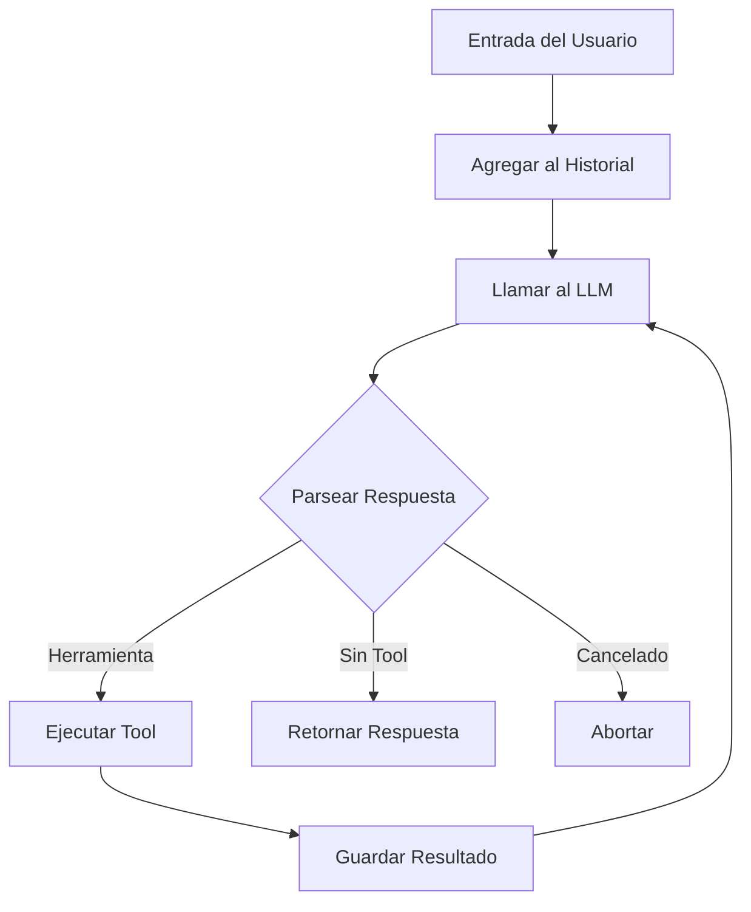
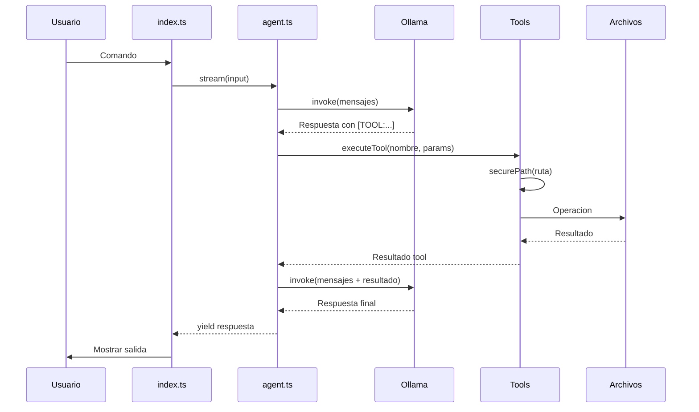
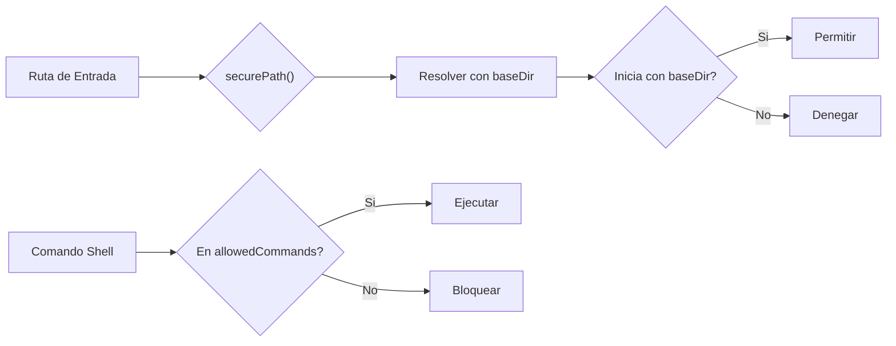

<p align="center">
  
  
  
</p>

# Archie File Agent

Agente de IA para gestión de archivos mediante lenguaje natural. Utiliza modelos LLM locales a través de Ollama para interpretar comandos y ejecutar operaciones de archivos de forma segura.

---

## Tabla de Contenidos

- [Caracteristicas](#caracteristicas)
- [Requisitos](#requisitos)
- [Instalacion](#instalacion)
- [Configuracion](#configuracion)
- [Uso](#uso)
- [Herramientas Disponibles](#herramientas-disponibles)
- [Seguridad](#seguridad)
- [Arquitectura](#arquitectura)

---

## Caracteristicas

| Funcion | Descripcion |
|---------|-------------|
| Listar archivos | Explora directorios con patrones glob |
| Leer archivos | Lee contenido de archivos de texto |
| Buscar en archivos | Encuentra texto dentro de multiples archivos |
| Mover/Renombrar | Organiza archivos facilmente |
| Crear carpetas | Estructura el espacio de trabajo |
| Eliminar | Con confirmacion de seguridad |
| Descargar | Descarga archivos desde URLs |
| Ejecutar comandos | Shell limitado por seguridad |

---

## Requisitos

- Node.js 18+
- Ollama instalado y corriendo
- Modelo LLM configurado en Ollama

---

## Instalacion

```bash
git clone https://github.com/Yonsn76/archie-file-agent.git
cd archie-file-agent
npm install
```

---

## Configuracion

### Opcion 1: Configurador interactivo

Ejecuta el configurador con doble click:

```
configurar.bat
```

Permite:
- Iniciar Ollama
- Listar y seleccionar modelos
- Configurar directorios
- Iniciar el agente

### Opcion 2: Manual

1. Copia el archivo de ejemplo:

```bash
cp .env.example .env
```

2. Edita `.env`:

```env
OLLAMA_BASE_URL=http://localhost:11434
OLLAMA_MODEL=llama3.2:3b
ARCHIE_BASE_DIR=./sandbox
EXTRA_READ_DIR=C:\Users\Tu\Downloads
```

| Variable | Descripcion |
|----------|-------------|
| `OLLAMA_BASE_URL` | URL del servidor Ollama |
| `OLLAMA_MODEL` | Nombre del modelo a utilizar |
| `ARCHIE_BASE_DIR` | Directorio de trabajo (lectura/escritura) |
| `EXTRA_READ_DIR` | Directorio adicional (solo lectura) |

---

## Uso

### Iniciar

```bash
npm run dev
```

### Comandos del agente

```
> lista todos los archivos
> busca archivos que contengan "TODO"
> mueve documento.txt a la carpeta proyectos
> crea una carpeta llamada backups
> que hay en el archivo readme.md?
> descarga https://example.com/file.txt
```

### Comandos del sistema

| Comando | Accion |
|---------|--------|
| `salir` / `exit` | Termina la sesion |
| `limpiar` / `clear` | Limpia el historial de conversacion |
| `[C]` | Cancela la operacion actual (durante ejecucion) |

---

## Herramientas Disponibles

| Herramienta | Parametros | Descripcion |
|-------------|------------|-------------|
| `listar_archivos` | directorio, patron | Lista archivos y carpetas |
| `leer_archivo` | archivo | Lee contenido de un archivo |
| `crear_archivo` | nombre, contenido | Crea un nuevo archivo |
| `mover_archivo` | origen, destino | Mueve o renombra |
| `crear_carpeta` | ruta | Crea un directorio |
| `eliminar_archivo` | ruta, confirmar | Elimina archivo o carpeta |
| `buscar_en_archivos` | texto, patron | Busca texto en archivos |
| `info_archivo` | archivo | Obtiene metadatos |
| `listar_directorio_extra` | patron, limite | Lista directorio extra |
| `copiar_desde_extra` | archivo, destino | Copia desde directorio extra |
| `ejecutar_comando` | comando, directorio | Ejecuta comando shell |
| `descargar_archivo` | url, nombre | Descarga desde URL |

---

## Seguridad

- Todas las operaciones estan restringidas al directorio base configurado
- La funcion `securePath()` valida que ninguna ruta escape del sandbox
- Comandos shell limitados a: `dir`, `ls`, `type`, `cat`, `find`, `where`, `echo`, `curl`, `wget`
- El directorio extra solo permite operaciones de lectura

---

## Arquitectura

```
archie-file-agent/
├── src/
│   ├── index.ts      # Entry point, loop principal
│   ├── agent.ts      # Logica del agente, integracion LLM
│   ├── config.ts     # Configuracion desde .env
│   ├── tools/
│   │   └── index.ts  # Definicion de herramientas
│   └── ui.ts         # Interfaz de terminal
├── sandbox/          # Directorio de trabajo por defecto
├── configurar.bat    # Configurador interactivo
└── .env              # Variables de entorno
```

### Stack

| Tecnologia | Uso |
|------------|-----|
| TypeScript | Lenguaje principal |
| LangChain.js | Framework de agentes |
| Ollama | LLM local |
| Zod | Validacion de schemas |
| Ora | Spinners de terminal |
| Chalk | Colores en terminal |

---

## Diagramas

### Arquitectura de Componentes



### Flujo del Agente



### Secuencia de Ejecucion



### Flujo de Seguridad




